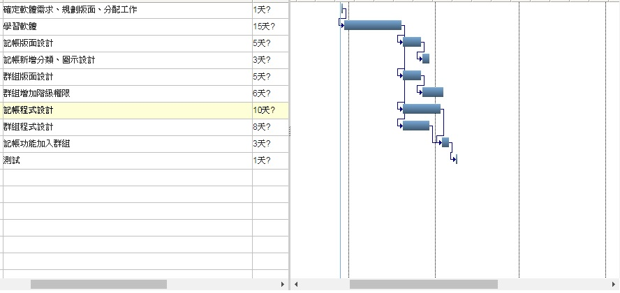

## 專題名稱:團控
### 組別:第9組
### 組員:郭向溱
### 專題內容:群組共用記帳、共用行事曆、出遊預算規劃

#### 非功能性
##### －安全-群組權限只由創始人為最高權限
##### －效能-共用行事曆、帳本保持立即更新
##### －備份-記帳應有輸出記錄檔
##### －整合性-單筆紀錄採記名，只由原始人可更改
##### －設計需求-JS、DB、OCR

#### 功能性
##### －記帳行事曆
##### －群組系統
##### －名片菜單收集冊

#### 工作
##### 郭向溱:聊天功能、LOGO設計、文書資料

##### 郭君怡:記帳功能、群組功能、畫面設計
